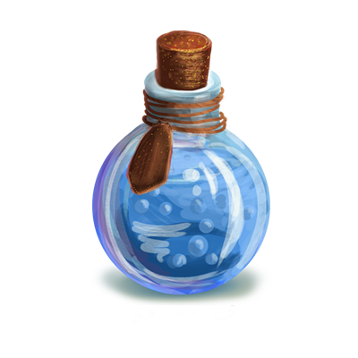
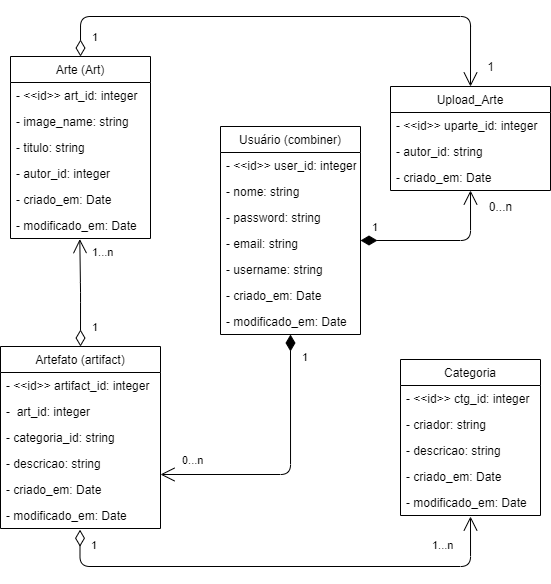

  

  <h3 align="center">Combine 🔥</h3>
  
Compartilhe sua arte

   

  ## Objetivos 📌
  
Possibilitar a divulgação das artes digital de designers gráficos independentes em busca oportunidades.

   

  ## Público-alvo 🔍️
  
 Designers indepentes que estão criando seu portifólio.

  
Pessoas que buscam mão de obra para arte digital.

   

  ## Mercado 📈
  
Busca permitir que os designers, iniciantes ou não, tenham a contato com o que o mercado de arte digital atual demanda e que possam compartilhar seu trabalho.

   

  ## Principais fundamentos ✅
  ### Para criar um usuário:
  
➡️ Inserir nome completo [  ]

  
 ➡️ Inserir email válido [  ]

  
 ➡️ Inserir username [  ]
  
 ➡️ Inserir senha com, no mínimo, 8 dígitos e que tenha a combinação de letras maiúsculas, minúsculas e numeros [  ]

  
 ➡️ Pode ter de 0 até N artefatos cadastrados [  ]

   

  ### Para criar um artefato (conjunto de imagens banners):
  
 ➡️ Estar logado com um usuário autenticado [  ]

  
 ➡️ Pode ter mais de uma categoria [  ]

  
 ➡️ Informar um categoria válida (que já esteja criada) ou criar uma nova categoria [  ]

  
 ➡️ Uma artefato pode ter de 1 até N categorias cadastrados [  ]

  
 ➡️ Informar uma descrição para este artefato [  ]

  
 ➡️ Um artefato pode ter de 1 até N artes [  ]

  
 ➡️ Um artefato pode ter de 1 até N categorias [  ]

   

  ### Para criar uma arte:
   
 ➡️ Estar logado com um usuário autenticado [  ]

   
 ➡️ O ID do autor será o ID do usuário logado ao criar a arte [  ]

   
 ➡️ Cada arte terá uma imagem [  ]

   
 ➡️ A imagem da arte deve ser identificada pelo nome do arquivo upado [  ]

   
 ➡️ Inserir um título para sua arte [  ]

   

  ### Para criar uma categoria:
   
 ➡️ Estar logado com um usuário autenticado [  ]

   
 ➡️ O criado será o nome do usuário logado que criar a categoria [  ]

   
 ➡️ Informar um título para a categoria [  ]

   
 ➡️ Informar uma descrição para a categoria [  ]

   
  
  ## Diagrama
  

  
  

   

